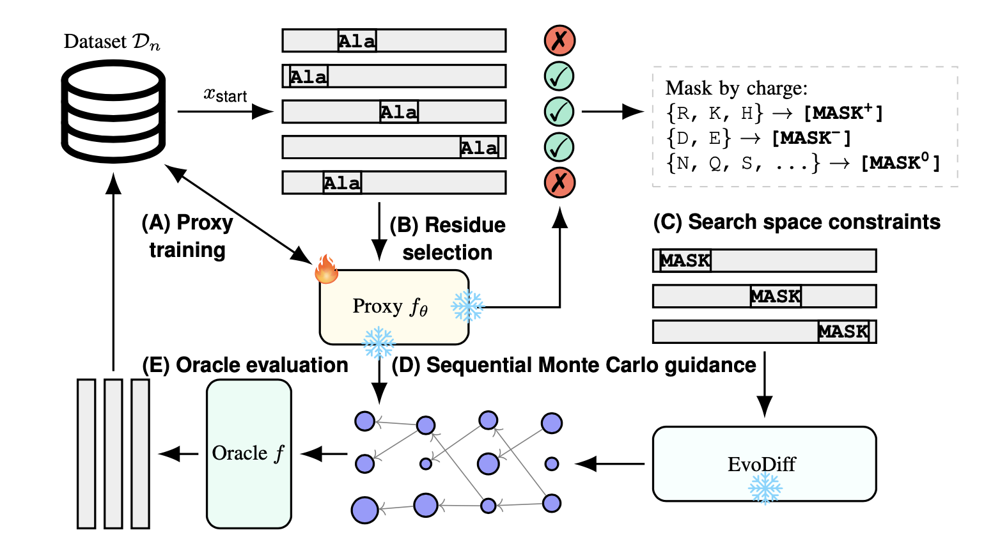

**Official implementation of "ProSpero: Active Learning for Robust Protein Design Beyond Wild-Type Neighborhoods" [NeurIPS 2025]** <br>
[Paper link](https://arxiv.org/abs/2505.22494)



## Installation
### Step 1: environment setup
```
conda env create -f environment.yml
conda activate prospero_env
pip install -e .
```

### Step 2: download oracles
```
chmod +x bash/*
./bash/download_oracles.sh
```


## Reproducing Paper's Results

### Protein Fitness Optimization
To reproduce the results of ProSpero across all the protein landscapes (Section 5.1 & Section 5.3) run:
```
./bash/run_all_landscapes.sh <path_to_results_dir>
```

### Noise Robustness Study
To reproduce the results of ProSpero under the noisy surrogate setting (Section 5.4) run:
```
./bash/run_all_noise_levels.sh <path_to_results_dir>
```

## Running a Single Task
To run ProSpero on a single landscape run:

```
python ./src/prospero/runners/run_protein.py
```
with following command-line parameters available (but not limited to):

| Option | Type | Default | Description |
|---|---|---|---|
| `--task` | str | – | Choices: 8 protein fitness landscapes + 3 covariate shifts on UBE2I|
| `--results_dirpath` | str | – | Directory where results are saved|
| `--n_queries` | int | `128` | Oracle per-round evaluation budget |
| `--n_iters` | int | `10` | Number of active learning iterations |
| `--full_deterministic` | flag | `false` | Enable deterministic behavior for reproducibility |
| `--batch_size` | int | `256` | SMC batch size |
| `--alphabet` | str | `CHARGE` | RAA used in the biologically-constrained SMC |
| `--kappa_scan` | float | `1.0` | UCB exploitation-exploration hyperparam used in the targeted masking |
| `--kappa_guidance` | float | `0.1` | UCB exploitation-exploration hyperparam used in the biologically-constrained SMC|
| `--n_checks_multiplier` | int | `16` | Number of scans used in the targeted masking (in the paper denoted by "S") |
| `--min_corruptions` | int | `3` | Minimum number of alanine substitutions in the targeted masking |
| `--max_corruptions` | int | `10` | Maximum number of alanine substitutions in the targeted masking|


## Code referencing paper algorithms
See `./src/prospero/inference.py` for code annotated with references to the paper's algorithms

## Issue reporting
If you encounter a problem or have a question, please either open an issue in this repository or email us at <michal.kmicikiewicz@helmholtz-munich.de>

## Citation
If you find this work useful, please cite:
```bibtex
@misc{kmicikiewicz2025prosperoactivelearningrobust,
      title={ProSpero: Active Learning for Robust Protein Design Beyond Wild-Type Neighborhoods}, 
      author={Michal Kmicikiewicz and Vincent Fortuin and Ewa Szczurek},
      year={2025},
      eprint={2505.22494},
      archivePrefix={arXiv},
      primaryClass={cs.LG},
      url={https://arxiv.org/abs/2505.22494}, 
}
```